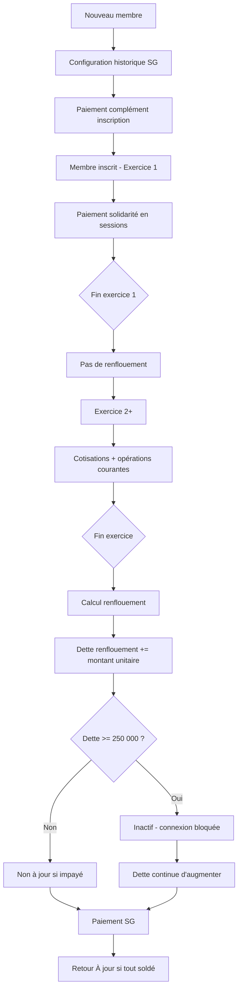
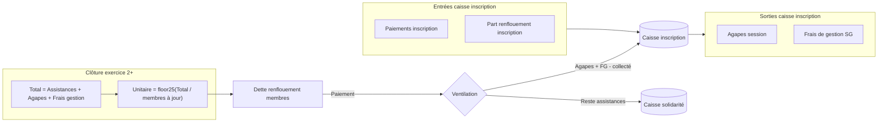
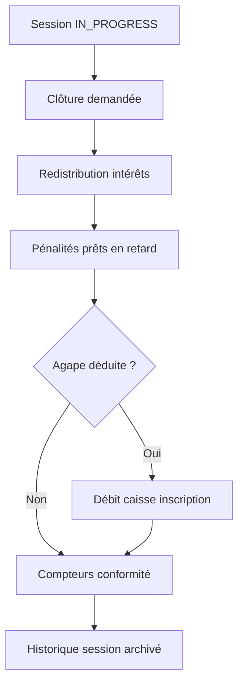

# Fonctionnement de la Mutuelle ENSPY

Document de référence décrivant les règles métier, les flux financiers et le comportement du système tel qu’implémenté dans l’application **Mutuelle Mobile** (backend Spring Boot + interfaces admin et membre).

---

## Table des matières

1. [Vue d’ensemble](#1-vue-densemble)
2. [Acteurs et rôles](#2-acteurs-et-rôles)
3. [Structure temporelle : exercice et session](#3-structure-temporelle--exercice-et-session)
4. [Les caisses de la mutuelle](#4-les-caisses-de-la-mutuelle)
5. [Inscription des membres](#5-inscription-des-membres)
6. [Solidarité](#6-solidarité)
7. [Sessions de cotisation](#7-sessions-de-cotisation)
8. [Agapes et frais de gestion](#8-agapes-et-frais-de-gestion)
9. [Renflouement (renflouement de la solidarité)](#9-renflouement-renflouement-de-la-solidarité)
10. [Statuts des membres](#10-statuts-des-membres)
11. [Insolvabilité (conséquence, pas un statut)](#11-insolvabilité-conséquence-pas-un-statut)
12. [Épargne](#12-épargne)
13. [Prêts et pénalités](#13-prêts-et-pénalités)
14. [Assistances](#14-assistances)
15. [Intérêts d’emprunt](#15-intérêts-demprunt)
16. [Clôture d’exercice](#16-clôture-dexercice)
17. [Paramètres configurables](#17-paramètres-configurables)
18. [Récapitulatif des dettes](#18-récapitulatif-des-dettes)
19. [Schémas de flux](#19-schémas-de-flux)

---

## 1. Vue d’ensemble

La mutuelle est une association d’entraide financière. Chaque **membre inscrit** dispose d’un compte avec :

- une **épargne** personnelle ;
- des **dettes** éventuelles (inscription, solidarité, renflouement, prêt) ;
- un **statut mutuelle** calculé automatiquement.

La trésorerie globale de la mutuelle est répartie en **trois caisses** :

| Caisse | Rôle principal |
|--------|----------------|
| **Inscription** | Compléments d’inscription, renflouement partiel (agapes + frais de gestion), financement des agapes |
| **Solidarité** | Cotisations de solidarité, part « assistances » du renflouement |
| **Épargne globale** | Épargnes cumulées, prêts, remboursements, assistances |

Les opérations se déroulent dans le cadre d’**exercices** (périodes annuelles) subdivisés en **sessions** (réunions mensuelles de cotisation).

---

## 2. Acteurs et rôles

| Rôle | Interface | Principales actions |
|------|-----------|-------------------|
| **Secrétaire générale** (`ADMIN`) | Console admin | Opérations sur les membres, sessions, inscriptions, épargne, prêts, solidarité, renflouement, frais de gestion, demande de clôture d’exercice |
| **Président** (`PRESIDENT`) | Console admin (lecture) | Consultation |
| **Trésorier** (`TRESORIER`) | Console admin (lecture) | Consultation |
| **Commissaire aux comptes** (`COMMISSAIRE_COMPTE`) | Console CAC | Validation ou rejet de la clôture d’exercice, consultation |
| **Super admin** (`SUPER_ADMIN`) | Administration système | Configuration avancée |
| **Membre** (`MEMBER`) | Application membre | Consultation solde, demandes d’assistance, historique |

> **Note :** la secrétaire générale ne peut plus activer/désactiver manuellement un membre. Le statut mutuelle est calculé automatiquement.

---

## 3. Structure temporelle : exercice et session

### Exercice

- Période budgétaire annuelle (ex. « EXERCICE 2026 »).
- Démarré par la secrétaire générale.
- Clôturé après validation du Commissaire aux comptes.
- **Les dettes et épargnes des membres persistent d’un exercice à l’autre.**

### Session

- Réunion mensuelle de cotisation rattachée à un exercice.
- Une seule session **en cours** (`IN_PROGRESS`) à la fois.
- Cycle : **Planifiée → En cours → Clôturée**.

### Règle fondamentale : 1er vs 2e exercice

| Exercice | Focus principal |
|----------|-----------------|
| **1er exercice** | **Inscription + solidarité** uniquement. **Aucun renflouement** n’est calculé à la clôture. |
| **À partir du 2e exercice** | Calcul du **renflouement** à chaque clôture d’exercice. |

---

## 4. Les caisses de la mutuelle

### Caisse inscription (`registrationAmount`)

**Entrées :**
- Paiements du complément d’inscription par les membres ;
- Part « inscription » des paiements de renflouement (agapes + frais de gestion).

**Sorties :**
- Agapes (si déduites à la clôture de session) ;
- Frais de gestion (retraits par la secrétaire générale, session ouverte).

### Caisse solidarité (`solidarityAmount`)

**Entrées :**
- Cotisations de solidarité ;
- Part « solidarité » des paiements de renflouement (essentiellement la part assistances).

**Sorties :**
- Assistances approuvées versées aux membres.

### Épargne globale (`savingAmount`)

**Entrées :**
- Versements d’épargne des membres ;
- Remboursements de prêts ;
- Reliquats d’intérêts non redistribués.

**Sorties :**
- Octroi net des prêts ;
- Retraits d’épargne des membres (par la SG).

---

## 5. Inscription des membres

### Principe

L’inscription est **obligatoire** pour accéder au système. Le tarif de référence actuel est de **60 000 FCFA** (configurable).

Les membres historiques ont payé des montants différents (10 000, 15 000, etc.). Il n’y a **plus de montant par défaut uniforme** : chaque membre doit être configuré individuellement.

### Configuration historique (secrétaire générale)

Pour chaque membre, la SG saisit :

1. **Date de première inscription** ;
2. **Montant déjà payé** à l’époque.

Le système calcule :

```
Complément dû = Tarif actuel (60 000) − Montant historique payé
```

**Exemple :** membre ayant payé 10 000 FCFA → complément = 50 000 FCFA.

### Paiement

- Le complément se paie **en une seule fois** (pas de paiement partiel).
- Seul le **complément** entre dans la **caisse inscription** (pas le montant historique).
- Tant que le complément n’est pas payé, le membre est **Non inscrit** (`PENDING`) :
  - considéré comme **externe à la réunion** ;
  - **aucune** opération financière possible ;
  - connexion membre bloquée avec message invitant à payer chez la SG.

### Statut affiché

| Statut technique | Libellé affiché |
|------------------|-----------------|
| `PENDING` | **Non inscrit** |

---

## 6. Solidarité

### Montant

Cotisation de solidarité par défaut : **150 000 FCFA** (configurable), payable par tranches pendant les sessions.

### Période

La solidarité est le pilier du **1er exercice**. Les membres paient leur cotisation session par session.

### Effet sur le statut

Une solidarité impayée contribue au statut **Non à jour** (avec le renflouement).

---

## 7. Sessions de cotisation

### Ouverture

La secrétaire générale ouvre une session dans un exercice **en cours** (`IN_PROGRESS`) :

- Nom de la session (ex. « SESSION JUILLET 2026 ») ;
- Montant d’agape configuré pour cette session (valeur par défaut : 5 000 FCFA).

### Pendant la session

La SG peut, pour chaque membre inscrit :

- Enregistrer un versement d’**épargne** ;
- Effectuer un **retrait d’épargne** (si aucun prêt en cours) ;
- Accorder un **prêt** ou enregistrer un **remboursement** ;
- Enregistrer le paiement de **solidarité** ;
- Enregistrer le paiement d’**inscription** ou de **renflouement** ;
- Enregistrer des **retraits de frais de gestion** sur la caisse inscription.

### Clôture de session

À la clôture, le système :

1. **Redistribue les intérêts** accumulés pendant la session (aux épargnants à jour) ;
2. **Applique les pénalités de prêt** si conditions remplies ;
3. **Déduit l’agape** de la caisse inscription **uniquement si la SG coche l’option** ;
4. Met à jour les **compteurs de conformité** (sessions non à jour, cooldown assistance) ;
5. Archive l’historique de session.

> **Agape :** si le solde de la caisse inscription est insuffisant, la clôture avec agape est **refusée**.

---

## 8. Agapes et frais de gestion

### Agapes

- Montant configuré **par session** (défaut : 5 000 FCFA).
- Financées par la **caisse inscription**.
- Déduction **optionnelle** à la clôture (case à cocher par la SG).
- Comptabilisées dans le total des dépenses de l’exercice pour le renflouement.

### Frais de gestion

Retraits effectués par la **secrétaire générale** sur la caisse inscription :

| Règle | Détail |
|-------|--------|
| Quand | **Uniquement pendant une session ouverte** |
| Description | **Obligatoire** (3 à 500 caractères) |
| Solde | **Blocage** si montant > solde caisse inscription |
| Traçabilité | Transaction `FRAIS_GESTION`, **non supprimable** |
| Visibilité | Liste consultable par exercice (admin, président, trésorier, CAC) |

Les frais de gestion entrent dans le **Total** du calcul de renflouement et dans le **plafond inscription** lors des paiements de renflouement.

---

## 9. Renflouement (renflouement de la solidarité)

Le renflouement permet de **refinancer les caisses** après les dépenses de l’exercice (assistances, agapes, frais de gestion). Il ne s’applique **qu’à partir du 2e exercice clôturé**.

### Calcul à la clôture d’exercice

```
Total = Assistances de l'exercice + Agapes de l'exercice + Frais de gestion de l'exercice
```

*(Uniquement l’exercice en cours de clôture — pas les exercices précédents.)*

```
Montant unitaire = arrondi au multiple de 25 inférieur (Total ÷ nombre de membres à jour)
```

### Définition « membre à jour » (pour le diviseur)

Un membre compte dans le diviseur s’il a soldé :

- son **inscription** ;
- sa **solidarité** ;
- son **renflouement**.

Les **non-inscrits** (`PENDING`) sont exclus.

### Assignation de la dette

**Tous les membres inscrits** (statuts `ACTIF`, `NON_A_JOUR`, `INACTIF`) reçoivent :

```
unpaidRenfoulement += Montant unitaire
```

- Les membres **hors règle** ne sont **pas** dans le diviseur, mais reçoivent quand même le montant unitaire → **cumul** de dette.
- Les **non-inscrits** (`PENDING`) sont **ignorés**.
- Les membres **inactifs** (`INACTIF`) continuent d’accumuler la dette même s’ils ne peuvent plus se connecter.

> **Important :** le renflouement **n’applique aucun intérêt**. C’est une dette distincte du prêt.

### Paiement du renflouement par un membre

Lorsqu’un membre paie sa dette de renflouement, le montant est **ventilé automatiquement** :

```
Capacité inscription restante = (Agapes + Frais de gestion de l'exercice) − Déjà versé en inscription
```

1. **D’abord** → caisse **inscription** (jusqu’à épuisement de la capacité, en parcourant les renfoulements du plus ancien au plus récent) ;
2. **Le reste** → caisse **solidarité**.

Des sous-transactions `RENFOULEMENT_INSCRIPTION` et `RENFOULEMENT_SOLIDARITE` tracent cette ventilation.

### Paiement tardif et assistance

Si un membre paie son renflouement **après 4 sessions ou plus** de retard (`sessionsInNonAJour ≥ 4`), un **cooldown de 3 sessions** bloque les nouvelles demandes d’assistance.

---

## 10. Statuts des membres

Les statuts sont calculés **automatiquement** à partir des dettes de **solidarité** et de **renflouement** uniquement — **pas** à partir de la dette de prêt.

| Statut | Libellé | Condition |
|--------|---------|-----------|
| `PENDING` | **Non inscrit** | Complément d’inscription non payé |
| `ACTIF` | **À jour** | Inscription soldée + solidarité = 0 + renflouement = 0 |
| `NON_A_JOUR` | **Non à jour** | Dette solidarité + renflouement > 0 **et** < seuil inactivité |
| `INACTIF` | **Inactif** | Dette solidarité + renflouement ≥ **250 000 FCFA** |

### Seuil d’inactivité

```
solidarité impayée + renflouement impayé ≥ 250 000 FCFA  →  INACTIF
```

Conséquences du statut **Inactif** :

- **Connexion membre bloquée** ;
- La dette de renflouement **continue d’augmenter** à chaque clôture d’exercice ;
- Le membre peut régulariser sa situation en payant chez la secrétaire générale.

### Connexion membre

| Situation | Connexion |
|-----------|-----------|
| Non inscrit | Bloquée |
| Inactif | Bloquée |
| Non à jour | Autorisée (avec avertissements) |
| À jour | Autorisée |

---

## 11. Insolvabilité (conséquence, pas un statut)

L’**insolvabilité** n’est **pas** un statut enum. C’est une **conséquence affichée** lorsqu’un membre a une dette de solidarité et/ou renflouement **et** a accumulé **3 sessions ou plus** sans tout régler.

### Effets de l’insolvabilité

| Effet | Détail |
|-------|--------|
| **Blocage des prêts** | Impossible d’accorder un nouveau prêt |
| **Affichage** | Bannière « insolvable » dans l’interface membre et admin |
| **Compteur** | `sessionsBeforeLoanBlock` indique les sessions restantes avant blocage |

### Compteur de sessions non à jour

À chaque **clôture de session**, pour chaque membre :

- Si dette (solidarité + renflouement) > 0 et < 250 000 → `sessionsInNonAJour` + 1 ;
- Si dette = 0 → compteur remis à 0.

**Exemple :** membre paie son inscription mais pas sa solidarité → à la 4e session clôturée (3 sessions de retard), il devient **insolvable** et ne peut plus emprunter.

---

## 12. Épargne

### Versement

- Enregistré par la SG pendant une session ouverte.
- Augmente l’épargne du membre et l’épargne globale.
- **Bloqué** si le membre est non inscrit (`PENDING`).

### Retrait

- Effectué par la **secrétaire générale** pour le compte du membre.
- **Condition :** le membre ne doit avoir **aucun prêt en cours** (`borrowAmount = 0`).
- **Bloqué** si solde insuffisant.

### Plafond d’emprunt

Le plafond dépend de l’épargne du membre via des **paliers** configurables :

| Tranche d’épargne | Multiplicateur | Plafond max |
|-------------------|----------------|-------------|
| 0 – 500 000 | × 5 | 2 000 000 |
| 500 001 – 1 000 000 | × 4 | — |
| 1 000 001 – 1 500 000 | × 3 | — |
| 1 500 001 – 2 000 000 | × 2 | 4 000 000 |
| > 2 000 000 | × 1,5 | — |

---

## 13. Prêts et pénalités

### Octroi d’un prêt

**Conditions :**

- Membre inscrit et **non insolvable** ;
- Session ouverte ;
- Épargne > 0 ;
- Aucun prêt en cours ;
- Montant ≤ plafond d’emprunt.

**Calcul :**

```
Intérêt d'octroi = Montant demandé × Taux (défaut 3 %)
Montant net versé au membre = Montant demandé − Intérêt
```

L’intérêt d’octroi est accumulé dans la session et **redistribué à la clôture** aux épargnants à jour (proportionnellement à leur épargne, arrondi au multiple de 25 inférieur).

### Remboursement

- Enregistré par la SG pendant une session ouverte.
- Diminue la dette de prêt du membre.

### Pénalités de retard

Appliquées automatiquement à la **clôture de session** si :

- Le membre a un prêt en cours ;
- **3 sessions ou plus** se sont écoulées depuis l’octroi (ou depuis la dernière pénalité).

**Formule :**

```
Pénalité = 15 000 + 3 % × (dette prêt + dette renflouement)
```

*(Les montants et taux sont configurables.)*

**Prélèvement :**

1. D’abord sur l’**épargne** du membre ;
2. Le **reliquat** est ajouté à la **dette de prêt**.

Les pénalités se répètent tous les **3 sessions** tant que le prêt n’est pas remboursé intégralement.

> **Séparation des dettes :** le renflouement et le prêt restent deux comptes distincts. Seul le prêt porte des intérès d’octroi et des pénalités. La dette renflouement entre uniquement dans le calcul du montant de la pénalité, pas dans le statut mutuelle.

---

## 14. Assistances

### Demande (membre)

Un membre peut soumettre une demande d’assistance si :

- Il est **inscrit** ;
- Il n’a **pas** de solidarité impayée ;
- Il n’a **pas** de renflouement impayé ;
- Il n’est **pas** en cooldown assistance (3 sessions après paiement tardif de renflouement).

### Traitement (secrétaire générale)

- **Approuver** → débit de la caisse solidarité, crédit au membre ;
- **Rejeter** → avec motif.

Les montants approuvés entrent dans le **Total assistances** de l’exercice pour le calcul du renflouement.

---

## 15. Intérêts d’emprunt

À chaque octroi de prêt, **3 %** du montant demandé sont prélevés comme intérêt d’octroi.

À la **clôture de session**, le total des intérêts accumulés est redistribué :

- Aux membres **à jour** (inscription + solidarité + renflouement soldés) **ayant une épargne > 0** ;
- **Proportionnellement** à leur épargne ;
- Arrondi au **multiple de 25 inférieur** ;
- Reliquat → caisse globale.

---

## 16. Clôture d’exercice

### Processus

1. La SG **demande la clôture** (toutes les sessions doivent être clôturées).
2. L’exercice passe en `PENDING_CLOSURE`.
3. Le **Commissaire aux comptes** approuve ou rejette.
4. Si approuvé :
   - Historique d’exercice créé ;
   - **Renflouement calculé** (sauf 1er exercice) ;
   - Bilans membres générés.

### Renflouement à la clôture

| Exercice clôturé | Action |
|------------------|--------|
| 1er | Aucun renflouement |
| 2e et suivants | Calcul et assignation du montant unitaire |

---

## 17. Paramètres configurables

| Paramètre | Valeur par défaut | Description |
|-----------|-------------------|-------------|
| `registrationFeeAmount` | 60 000 FCFA | Tarif d’inscription actuel |
| `solidarityFeeAmount` | 150 000 FCFA | Cotisation de solidarité |
| `loanInterestRatePercent` | 3 % | Intérêt à l’octroi du prêt |
| `loanPenaltyFixedAmount` | 15 000 FCFA | Part fixe de la pénalité |
| `loanPenaltyRatePercent` | 3 % | Part proportionnelle de la pénalité |
| `loanPenaltySessionThreshold` | 3 sessions | Délai avant pénalité |
| `insolvencyThreshold` | 250 000 FCFA | Seuil d’inactivité |
| `defaultAgapeAmount` | 5 000 FCFA | Agape par défaut à l’ouverture de session |

---

## 18. Récapitulatif des dettes

| Type de dette | Champ | Intérêts | Pénalités | Impact statut | Cumul exercices |
|---------------|-------|----------|-----------|---------------|-----------------|
| **Inscription** | `unpaidRegistrationAmount` | Non | Non | → Non inscrit | Non |
| **Solidarité** | `unpaidSolidarityAmount` | Non | Non | → Non à jour / Inactif | Non |
| **Renflouement** | `unpaidRenfoulement` | Non | Non | → Non à jour / Inactif | **Oui** |
| **Prêt** | `borrowAmount` | Oui (octroi) | Oui (retard) | **Aucun** | Non |

---

## 19. Schémas de flux

### Parcours type d’un membre



### Cycle des caisses et renflouement



### Clôture de session



---

## Annexe : types de transactions

| Type | Direction | Description |
|------|-----------|-------------|
| `INSCRIPTION` | CREDIT | Paiement complément inscription |
| `EPARGNE` | CREDIT / DEBIT | Versement ou retrait épargne |
| `SOLIDARITE` | CREDIT | Paiement solidarité |
| `EMPRUNT` | DEBIT | Octroi de prêt |
| `REMBOURSSEMENT` | CREDIT | Remboursement prêt |
| `RENFOULEMENT` | DEBIT | Dette renflouement assignée ou payée |
| `RENFOULEMENT_INSCRIPTION` | CREDIT | Ventilation renflouement → inscription |
| `RENFOULEMENT_SOLIDARITE` | CREDIT | Ventilation renflouement → solidarité |
| `INTERET` | CREDIT | Redistribution intérêts |
| `ASSISTANCE` | DEBIT | Versement assistance approuvée |
| `AGAPE` | DEBIT | Déduction agape caisse inscription |
| `PENALITE` | DEBIT | Pénalité prêt (épargne ou dette prêt) |
| `FRAIS_GESTION` | DEBIT | Retrait frais de gestion (caisse inscription) |

---

*Document généré à partir de l’implémentation backend `MUTUEL/` et des règles métier validées. Dernière mise à jour : juillet 2026.*
